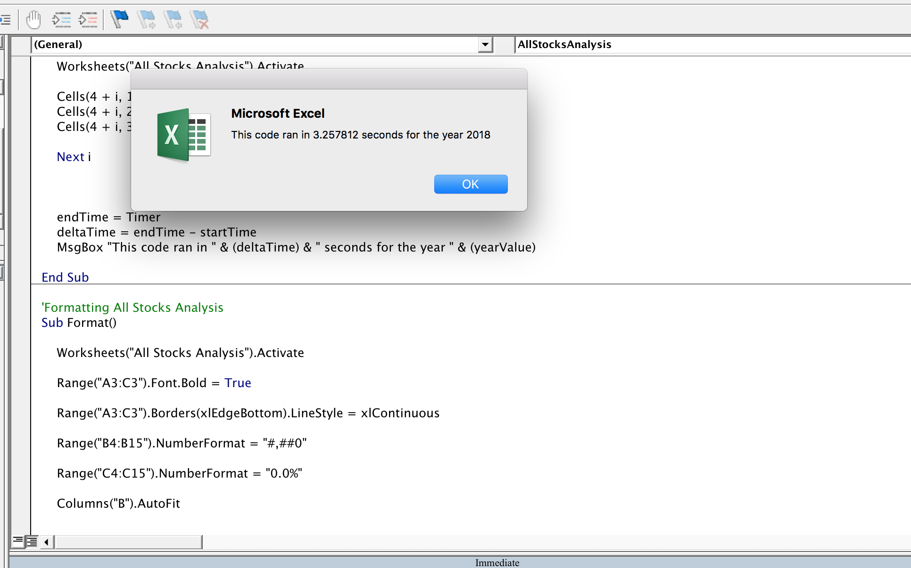
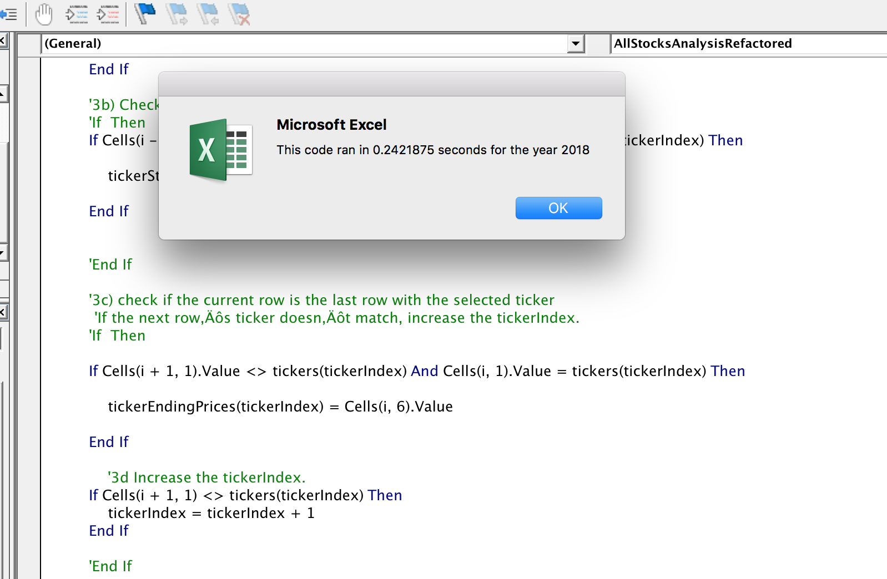

# Refactoring Stock Analysis Code in VBA

## Overview

This project's goal is to make an existing code used to analyze stocks with VBA more efficient. 

## Methods
The main idea was to eliminate a nested for loop in favor of a single for loop and that  arrays and conditionals to account for the different tickers.

---

## Results

The refactored code was faster as expected. The runtime was reduced by around a factor of 10 which, again, was expected because the nested for loop went through the stock data 11 times. Whereas the refactored code went through it just once. The arrays are small so the memory used to store them was fairly negigable. If we were dealing with 100,000's of tickers the methods again might have to be adjusted. 

Below is the original runtime:

And the refactored runtime:

## Summary

Refactoring the code offered a significant reduction in time used to run the script. It only makes sense to do, however, if optimization is a concern (ie big data sets) because the time used to refactor was much larger than the time saved by the refactoring. 

As mentioned above. The advantage of the refactored script was that it used significantly less time and computing resources to deliver a result. The trade off is storage in the form of arrays.

